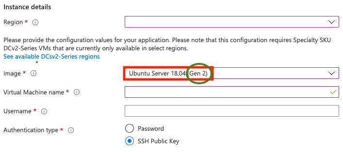
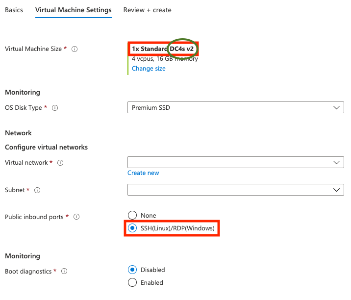

# Deploying to Azure

## Introduction

Microsoft Azure provides ready-made VMs that support the latest attestation protocols. This document explains the
background and provides a walkthrough showing how to get such a VM.

## Background: The DCAP protocol

!!! note
    If you just want to deploy to Azure as quickly as possible you can skip this section.

There are two protocols for establishing what code is running in an enclave: EPID and DCAP. EPID is an older
protocol designed for consumer applications, and as such includes some sophisticated privacy features. For servers
where the IP address doesn't need to be hidden (because it's public in DNS to begin with), these features 
aren't helpful and thus there is DCAP (_datacenter attestation primitives_). DCAP requires more modern hardware 
but is otherwise simpler and more robust. You may also see it referred to as "ECDSA attestation".

In DCAP repeating attestation requests aren't forwarded to Intel, but rather served from a cache. A newly installed 
machine obtains a machine certificate from Intel via the cache which may then be persisted to disk. All this is
automated for you.

Because caches are run by cloud providers DCAP supports vendor-specific plugins. Intel provides a default one 
which requires a [subscription](https://api.portal.trustedservices.intel.com/products/liv-intel-software-guard-extensions-provisioning-certification-service).  

Azure provides a DCAP [plugin](https://github.com/microsoft/Azure-DCAP-Client) that does not require a subscription. Conclave 
bundles and uses that plugin by default. The Azure caches are open to the public internet and can actually
be used from anywhere. Azure Confidential Computing instances (DC4s_v2) come pre-provisioned for DCAP and as Conclave
comes with the necessary libraries bundled, you don't need to do any further setup.

## Machine setup

You need to create an Ubuntu 18.04 LTS Gen2 VM from the confidential compute line (named like this: DC?s_v2) where the
question mark is the size. Other distributions should work as long as they are on these VMs, but we haven't tested them.



You might have to click "Browse all public and private images" to find `Gen2` image type.
Pick a size that's got plenty of RAM, for example, you might want to click "Select size" to find `DC4s_v2` type.  
 


Just in case:

* Check that the `/dev/sgx/enclave` device is present.
* Check driver version `dmesg | grep sgx`. Conclave requires driver version 1.33+.
* If either check fails:
  * Download the [driver](https://01.org/intel-softwareguard-extensions/downloads/intel-sgx-dcap-1.8-release).
  * Follow the install [instructions](https://download.01.org/intel-sgx/sgx-dcap/1.8/linux/docs/Intel_SGX_DCAP_Linux_SW_Installation_Guide.pdf).

You may need to add your user into `sgx_prv` group to give it access to SGX.

```sh
sudo usermod -aG sgx_prv $USER
```

### A Plugin
In order to perform attestation using DCAP Conclave needs a way to gather information about the platform the enclave is hosted on. This information provides proof from Intel that a system supports SGX and that it is patched and up to date.

DCAP is designed to work on many different server topologies, therefore rather than directly connecting to Intel services to retrieve this information, the cloud vendor or owner of the SGX system must provide a DCAP client plugin that will provide the required information. Intel provide a generic DCAP client plugin as part of the DCAP runtime. In order to use this you also need to set up a Provisioning Certificate Caching Service (PCCS). Intel provide an example and some instructions [here](https://github.com/intel/SGXDataCenterAttestationPrimitives/blob/master/QuoteGeneration/pccs/README.md).

However, if you are using Azure things are a lot simpler. Microsoft has already written a DCAP client plugin that works with its Confidential Compute virtual machines. In fact, it also works outside of Azure for single CPU systems but this may not always be the case.

Follow these steps to ensure you are using the Azure DCAP client plugin:
* Identify the currently installed DCAP client plugin. It will always have a name of the form libdcap_quoteprov.so* .
```sh
ls /usr/lib/x86_64-linux-gnu/libdcap_quoteprov.so*
```
* If you already have the Azure plugin installed then it will contain the text 'AZDCAP'.
```sh
grep AZDCAP /usr/lib/x86_64-linux-gnu/libdcap_quoteprov.so*
```
* If the Azure plugin is not currently installed then:
    * You can build it from [source](github.com/microsoft/Azure-DCAP-Client).
    * Or extract from a pre-built package provided by Microsoft. E.g. for Ubuntu 18.04 via the command below (only libdcap_quoteprov.so is required).
```sh
wget https://packages.microsoft.com/ubuntu/18.04/prod/pool/main/a/az-dcap-client/az-dcap-client_1.6_amd64.deb && ar x az-dcap-client_1.6_amd64.deb data.tar.xz && tar xvJf data.tar.xz --transform='s/.*\///' ./usr/lib/libdcap_quoteprov.so && rm az-dcap-client_1.6_amd64.deb data.tar.xz
```
* The name and location of the DCAP client plugin has to be `/usr/lib/x86_64-linux-gnu/libdcap_quoteprov.so.1` .
```sh
cp $(Azure-DCAP-Client)/libdcap_quoteprov.so /usr/lib/x86_64-linux-gnu/libdcap_quoteprov.so.azure
ln -sf /usr/lib/x86_64-linux-gnu/libdcap_quoteprov.so.azure /usr/lib/x86_64-linux-gnu/libdcap_quoteprov.so.1
```
* Set the Azure DCAP client logging level to FATAL as the log out by default is fairly verbose.
```sh
export AZDCAP_DEBUG_LOG_LEVEL=FATAL
```
* If you have happen to have the Intel DCAP plugin installed alongside with Azure one, bear in mind that running `apt update` might reset the symlink above to point to Intel's plugin.

## Using Docker container(s)

If you plan to use a Docker container with DCAP hardware, you must map two different device files like this:

```sh
docker run --device /dev/sgx/enclave --device /dev/sgx/provision ...
```

!!! note
    Azure offers a "Confidential Kubernetes" service. At this time we haven't tested Conclave with that. If you try it,
    let us and the community know if it works (conclave-discuss@groups.io)

## Code for using DCAP attestation
    
You have to choose attestation method at compile time (see Host.java).
  
```java
enclave.start(new AttestationParameters.DCAP(), ... );
```

DCAP doesn't require any specific API keys or parameters, so just creating the empty object is sufficient to choose it.
