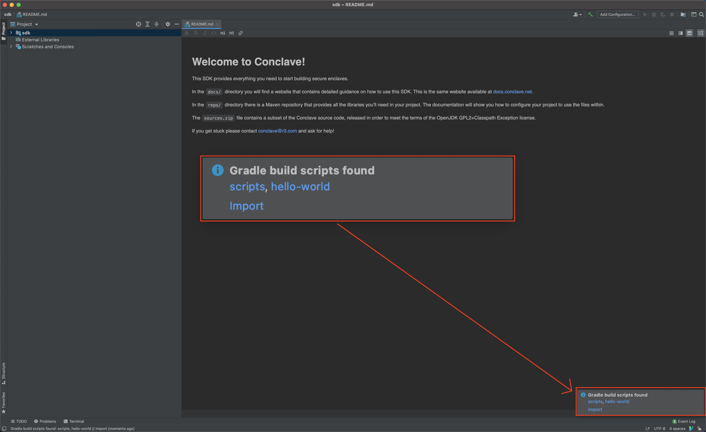

# First enclave

!!! important

    * You need the Conclave SDK. If you don't have it please [contact R3 and request a trial](https://www.conclave.net).
    * This tutorial assumes you've read and understood the [conceptual overview](enclaves.md).

You can find a **sample app** in the `hello-world` directory of your SDK. You can use this app as a template 
for your own if you want a quick start. We will cover:

1. How to set up your machine.
2. How to compile and run the sample app.
2. [How to write the sample app](writing-hello-world.md).

## Setting up your machine

You need Java 8 or 11 (your choice) and Gradle, so make sure you've installed those first. Alternatively use an IDE
like IntelliJ IDEA, which can download and set up both Gradle and the Java Development Kit (JDK) for you.

Currently we support developing enclaves on Windows and Linux. You can still *write* them on macOS and other
platforms as enclaves are just pure Java bytecode, but producing an executable JAR file won't be possible. Support for 
producing the final artifacts on macOS will come in a future release.

Executing enclaves requires Linux or a Linux container (e.g. via Docker or Windows Subsystem for Linux) and there are
no plans to change this. Apple doesn't support SGX and the Windows API support is too limited for use at this time.

Enclaves can run in simulation mode without requiring any special setup of Linux or SGX capable hardware. However you 
of course get no hardware protections. To run against real SGX hardware you must perform some [additional machine setup](machine-setup.md).

## Compiling the sample enclave

**Step 1:** Import the project
 


**Step 2:** Look at the Conclave SDK's top level directory

 
 
**Step 3:** Click "import" when notified that there's a Gradle build script

 
 
**Step 4:** If on Linux or Windows, double-click on `:host:assemble`. Voila! :smile: You have just built your first enclave.
  

  
Now explore the `build` folder. The program has been bundled into an executable JAR that contains the enclave JAR inside it
(complete with embedded JVM). You will need Linux to test your enclave. Just run the host app like any Java app - 
no special startup scripts are required with Conclave!
  
  
 
## Testing on Windows

If you're on Windows, you could test locally in simulation mode using a Docker container. Follow these instructions: 

**Step 1:** Create a container and install Java 8

Replace `c:/ws/sdk` with the path to the Conclave SDK:

```
docker run --name hello-world -it -d -v c:/ws/sdk:/sdk -w /sdk ubuntu bash
docker exec -ti hello-world apt update
docker exec -ti hello-world apt install -y openjdk-8-jdk
```

**Step 2:** Unpack the artifacts and run the `host` binaries

```
docker exec -ti hello-world tar xf /sdk/hello-world/host/build/distributions/host.tar -C /tmp/  
docker exec -ti hello-world /tmp/host/bin/host  
```

**Step 3:** You may want to create an IntelliJ launch configuration to incorporate the `build` and `deploy` stages.
Put the commands above in a .cmd batch file and then use the "Shell script" launch configuration type, and add
a Gradle task in the "Before launch" section. You will then be able to click the run icon in your IDE to
build and start up the Java host app inside the Docker container.   


**Step 4:** When done with testing remove the container, to stop it using up resources.  

```
docker rm hello-world -f
```  

If you get stuck please contact [conclave-discuss@groups.io](mailto:conclave-discuss@groups.io) and ask for help!  
